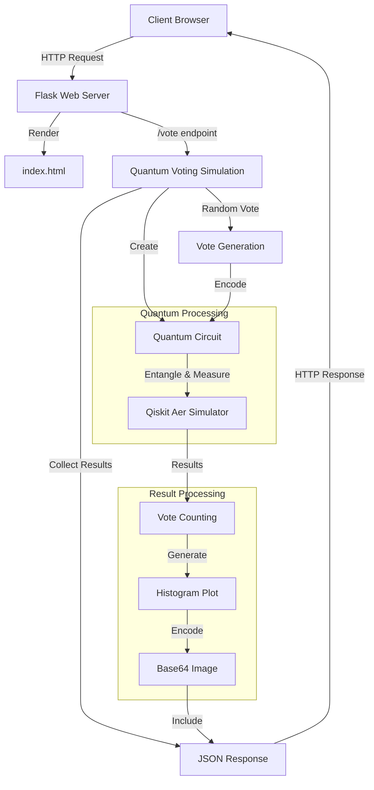

# <div align="center"> Q-Vote 🗳️ 
<i> </div> <p align="center"> A quantum voting system utilizing quantum superposition and entanglement for secure and private voting</i></b> </p>

## </div> <p align="center"> <b>Quantum Voting meets Blockchain!</b> </p>
## <p align="left">🚀 Project Overview</p>
Q-Vote simulates a secure voting process using quantum computing, with future plans for blockchain integration and a user-friendly web interface. This project uses Qiskit to simulate quantum voting and lays the groundwork for secure, private voting systems of the future.

<div align="center">

## <p align="left"> 🏗️ Architecture </p>



## </div> <p align="left">✨ Features</p>
- 🧑‍🔬 Quantum Voting using Qiskit
- 🗳️ Multiple Voters Simulation
- 📊 Voting Results Visualization with histograms
- 🛠️ Planned Improvements:
    - Blockchain integration for vote immutability
    - User-friendly web interface for voting
More voting options and candidate choices
<p align="left">⚙️ Tech Stack</p>
<div align="left">
<a href="https://qiskit.org/"></a> <a href="https://www.python.org/"></a> <a href="https://flask.palletsprojects.com/"></a> <a href="https://www.javascript.com/"></a> <a href="https://nodejs.org/en/"></a>

## </div> <p align="left">📋 Requirements</p>
To run Q-Vote, ensure you have the following installed:

- 🐍 Python 3.x
- 💻 Qiskit (install via pip)
### <p align="left">📦 Installation</p>
1. Clone this repository:

```bash
git clone https://github.com/YourUsername/Q-Vote.git
```
2. Navigate into the project directory:

```bash
cd Q-Vote
```
3. Create a virtual environment:

- On Windows:

```bash
python -m venv venv
```

- On macOS/Linux:

```bash
python3 -m venv venv
```
4. Activate the virtual environment:

- On Windows:

```bash
.\venv\Scripts\activate
```
- On macOS/Linux:

```bash
source venv/bin/activate
```
5. Install the required dependencies:

```bash
pip install -r requirements.txt
```
6. Run the quantum voting simulation:

```bash
python src/quantum_voting.py
```
The output will display vote counts, the winning candidate, and a histogram to visualize the results.

## <p align="left">🛠 Contributing</p>
We welcome contributions! Here's how you can contribute:

- [ ] 🔗 Implement blockchain integration for immutability.
- [ ] 🌐 Develop a web interface for a better voting experience.
- [ ] 🔄 Optimize quantum circuits for efficiency.
- [ ] ✍️ Write unit tests for code reliability.

### Steps to Contribute:
1. Fork the repository.

2. Create an issue for new features or bug fixes:

    - Go to the Issues section of the repository.
    - Create a new issue, providing a detailed description of the feature or bug.
    - Ask to be assigned to that issue by commenting on it.
    - Wait for confirmation or assignment of the issue before proceeding.
    - Sync your fork with the upstream repository to ensure you're working with the latest code:

```bash
git remote add upstream https://github.com/ORIGINAL_OWNER/REPOSITORY_NAME.git
git fetch upstream
git checkout main
git merge upstream/main
```
3. Create a new branch for your feature or fix:

```bash
git checkout -b feature-name
```
4. Make your changes and commit them:

```bash
git commit -m "Add some feature"
```
5. Push your branch to your fork:

```bash
git push origin feature-name
```
6. Create a Pull Request (PR):

- Go to your fork on GitHub.
- Click on the Compare & Pull Request button.
- In the PR description, reference the issue you're addressing using the format Closes #ISSUE_NUMBER.
- Ensure the maintainers review your PR and provide any necessary feedback.


## <p align="left">📄 License</p>
This project is licensed under the MIT licensed. See the [LICENSE](./LICENSE) file for details.

## <p align="left">❤️ Acknowledgments</p>
- 💻 Qiskit – The quantum computing SDK used in this project.
- 🙌 Contributors and community members – Thank you for your valuable feedback and suggestions.
## <div align="center"> <p>If you find this project helpful, give it a star ⭐!</p> </div>